<p align="center">
  
</p>

## Exploiting Diffusion Prior for Real-World Image Super-Resolution

[Paper](https://arxiv.org/abs/2305.07015) | [Project Page](https://iceclear.github.io/projects/stablesr/) | [Video](https://www.youtube.com/watch?v=5MZy9Uhpkw4) | [WebUI](https://github.com/pkuliyi2015/sd-webui-stablesr) | [ModelScope](https://modelscope.cn/models/xhlin129/cv_stablesr_image-super-resolution/summary)


<a href="https://colab.research.google.com/drive/11SE2_oDvbYtcuHDbaLAxsKk_o3flsO1T?usp=sharing"></a> [](https://huggingface.co/spaces/Iceclear/StableSR) [](https://replicate.com/cjwbw/stablesr) [](https://openxlab.org.cn/apps/detail/Iceclear/StableSR) 


[Jianyi Wang](https://iceclear.github.io/), [Zongsheng Yue](https://zsyoaoa.github.io/), [Shangchen Zhou](https://shangchenzhou.com/), [Kelvin C.K. Chan](https://ckkelvinchan.github.io/), [Chen Change Loy](https://www.mmlab-ntu.com/person/ccloy/)

S-Lab, Nanyang Technological University

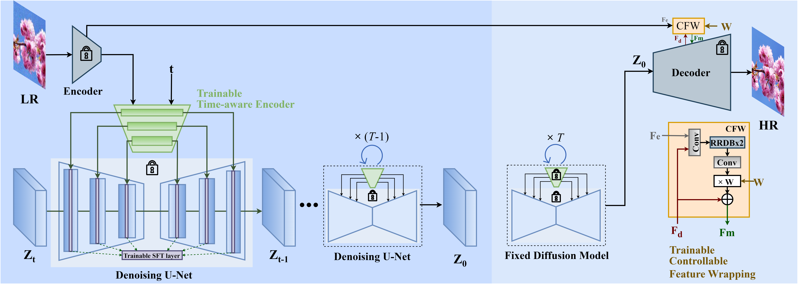

:star: If StableSR is helpful to your images or projects, please help star this repo. Thanks! :hugs:

### Update
- **2023.11.30**: Code Update.
  - Support DDIM and negative prompts
  - Add CFW training scripts
  - Add FaceSR training and test scripts (**Not test yet**)
- **2023.10.08**: Our test sets associated with the results in our [paper](https://arxiv.org/abs/2305.07015) are now available at [[HuggingFace](https://huggingface.co/datasets/Iceclear/StableSR-TestSets)] and [[OpenXLab](https://openxlab.org.cn/datasets/Iceclear/StableSR_Testsets)]. You may have an easy comparison with StableSR now.
- **2023.08.19**: Integrated to :hugs: [Hugging Face](https://huggingface.co/spaces). Try out online demo! [](https://huggingface.co/spaces/Iceclear/StableSR).
- **2023.08.19**: Integrated to :panda_face: [OpenXLab](https://openxlab.org.cn/apps). Try out online demo! [](https://openxlab.org.cn/apps/detail/Iceclear/StableSR).
- **2023.07.31**: Integrated to :rocket: [Replicate](https://replicate.com/explore). Try out online demo! [](https://replicate.com/cjwbw/stablesr) Thank [Chenxi](https://github.com/chenxwh) for the implementation!
- **2023.07.16**: You may reproduce the LDM baseline used in our paper using [LDM-SRtuning](https://github.com/IceClear/LDM-SRtuning) [](https://github.com/IceClear/LDM-SRtuning).
- **2023.07.14**: :whale: [**ModelScope**](https://modelscope.cn/models/xhlin129/cv_stablesr_image-super-resolution/summary) for StableSR is released!
- **2023.06.30**: :whale: [**New model**](https://huggingface.co/Iceclear/StableSR/blob/main/stablesr_768v_000139.ckpt) trained on [SD-2.1-768v](https://huggingface.co/stabilityai/stable-diffusion-2-1) is released! Better performance with fewer artifacts!
- **2023.06.28**: Support training on SD-2.1-768v.
- **2023.05.22**: :whale: Improve the code to save more GPU memory, now 128 --> 512 needs 8.9G. Enable start from intermediate steps.
- **2023.05.20**: :whale: The [**WebUI**](https://github.com/pkuliyi2015/sd-webui-stablesr) [](https://github.com/pkuliyi2015/sd-webui-stablesr) of StableSR is available. Thank [Li Yi](https://github.com/pkuliyi2015) for the implementation!
- **2023.05.13**: Add Colab demo of StableSR. <a href="https://colab.research.google.com/drive/11SE2_oDvbYtcuHDbaLAxsKk_o3flsO1T?usp=sharing"></a>
- **2023.05.11**: Repo is released.

### TODO
- [ ] StableSR-XL
- [ ] StableSR-Text
- [ ] ComfyUI support
- [ ] Acceleration
- [x] ~~Code release~~
- [x] ~~Update link to paper and project page~~
- [x] ~~Pretrained models~~
- [x] ~~Colab demo~~
- [x] ~~StableSR-768v released~~
- [x] ~~Replicate demo~~
- [x] ~~HuggingFace demo~~
- [x] ~~StableSR-face released~~

### Demo on real-world SR

[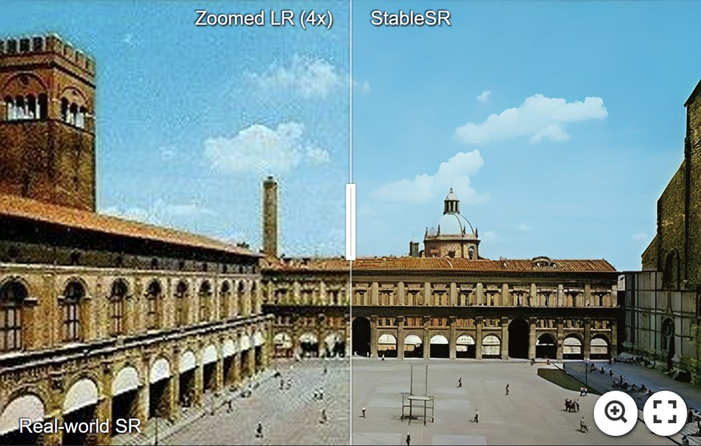](https://imgsli.com/MTc2MTI2) [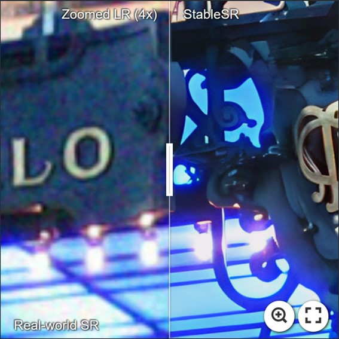](https://imgsli.com/MTc2MTE2) [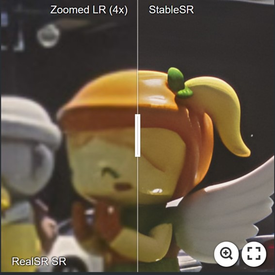](https://imgsli.com/MTc2MTIw)
[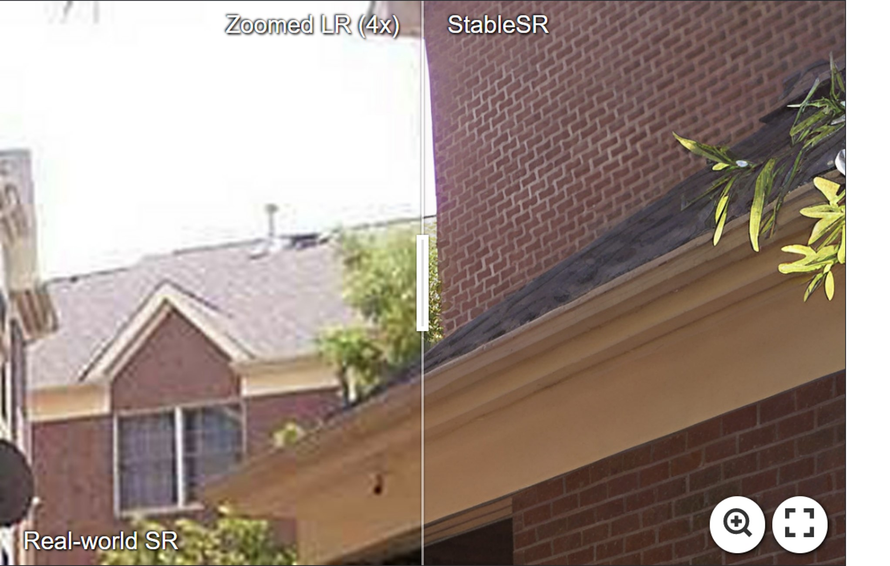](https://imgsli.com/MTc2MjUy) [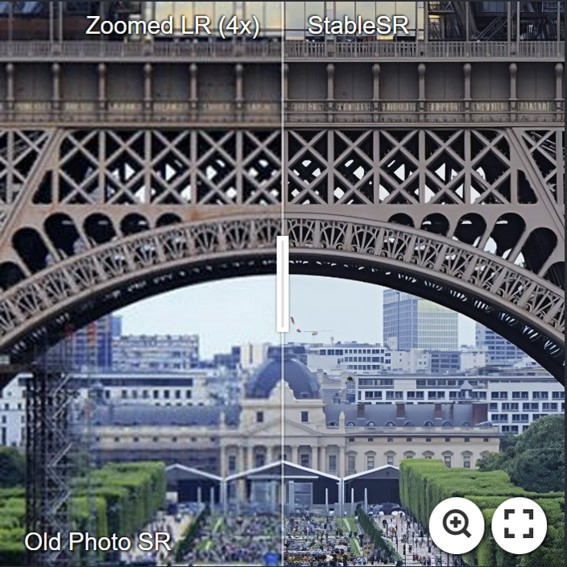](https://imgsli.com/MTc2MTMy) [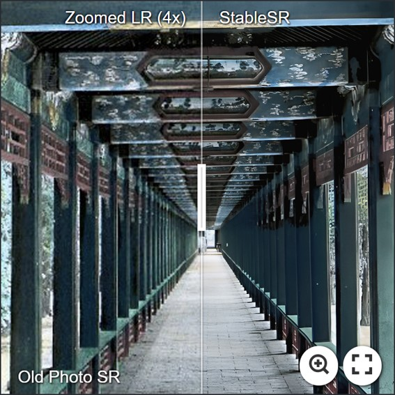](https://imgsli.com/MTc2MTMz)
[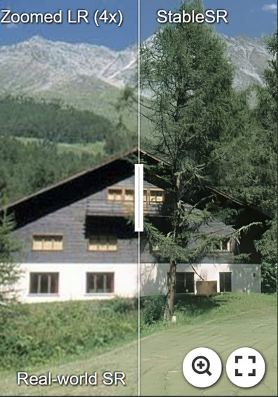](https://imgsli.com/MTc2MjQ5) [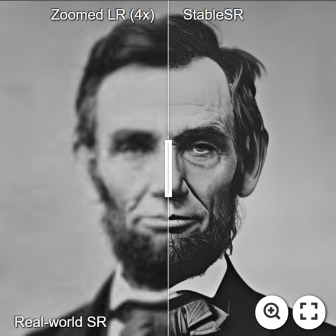](https://imgsli.com/MTc2MTM0) [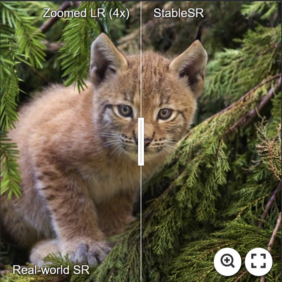](https://imgsli.com/MTc2MTM2) [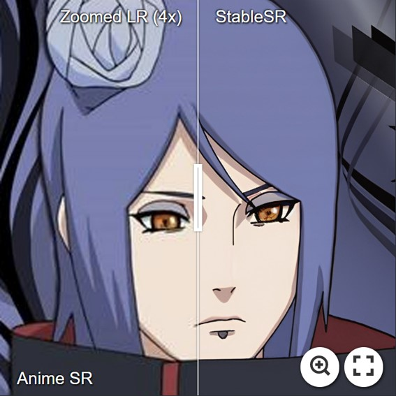](https://imgsli.com/MTc2MjU0)

For more evaluation, please refer to our [paper](https://arxiv.org/abs/2305.07015) for details.

### Demo on 4K Results

- StableSR is capable of achieving arbitrary upscaling in theory, below is an 4x example with a result beyond 4K (4096x6144).

[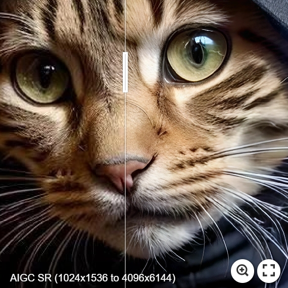](https://imgsli.com/MjIzMjQx)

```
# DDIM w/ negative prompts
python scripts/sr_val_ddim_text_T_negativeprompt_canvas_tile.py --config configs/stableSRNew/v2-finetune_text_T_768v.yaml --ckpt stablesr_768v_000139.ckpt --vqgan_ckpt vqgan_finetune_00011.ckpt --init-img ./inputs/test_example/ --outdir ../output/ --ddim_steps 20 --dec_w 0.0 --colorfix_type wavelet --scale 7.0 --use_negative_prompt --upscale 4 --seed 42 --n_samples 1 --input_size 768 --tile_overlap 48 --ddim_eta 1.0
```

- **More examples**.
  - [4K Demo1](https://imgsli.com/MTc4MDg3), which is a 4x SR on the image from [here](https://github.com/pkuliyi2015/multidiffusion-upscaler-for-automatic1111).
  - [4K Demo2](https://imgsli.com/MTc4NDk2), which is a 8x SR on the image from [here](https://github.com/Mikubill/sd-webui-controlnet/blob/main/tests/images/ski.jpg).
  - More comparisons can be found [here](https://github.com/IceClear/StableSR/issues/2) and [here](https://github.com/pkuliyi2015/sd-webui-stablesr).

### Dependencies and Installation
- Pytorch == 1.12.1
- CUDA == 11.7
- pytorch-lightning==1.4.2
- xformers == 0.0.16 (Optional)
- Other required packages in `environment.yaml`
```
# git clone this repository
git clone https://github.com/IceClear/StableSR.git
cd StableSR

# Create a conda environment and activate it
conda env create --file environment.yaml
conda activate stablesr

# Install xformers
conda install xformers -c xformers/label/dev

# Install taming & clip
pip install -e git+https://github.com/CompVis/taming-transformers.git@master#egg=taming-transformers
pip install -e git+https://github.com/openai/CLIP.git@main#egg=clip
pip install -e .
```

### Running Examples

#### Train
Download the pretrained Stable Diffusion models from [[HuggingFace](https://huggingface.co/stabilityai/stable-diffusion-2-1-base)]

- Train Time-aware encoder with SFT: set the ckpt_path in config files ([Line 22](https://github.com/IceClear/StableSR/blob/main/configs/stableSRNew/v2-finetune_text_T_512.yaml#L22) and [Line 55](https://github.com/IceClear/StableSR/blob/main/configs/stableSRNew/v2-finetune_text_T_512.yaml#L55))
```
python main.py --train --base configs/stableSRNew/v2-finetune_text_T_512.yaml --gpus GPU_ID, --name NAME --scale_lr False
```

- Train CFW: set the ckpt_path in config files ([Line 6](https://github.com/IceClear/StableSR/blob/main/configs/autoencoder/autoencoder_kl_64x64x4_resi.yaml#L6)).

You need to first generate training data using the finetuned diffusion model in the first stage.
```
# General SR
python scripts/generate_vqgan_data.py --config configs/stableSRdata/test_data.yaml --ckpt CKPT_PATH --outdir OUTDIR --skip_grid --ddpm_steps 200 --base_i 0 --seed 10000
```
```
# For face data
python scripts/generate_vqgan_data_face.py --config configs/stableSRdata/test_data_face.yaml --ckpt CKPT_PATH --outdir OUTDIR --skip_grid --ddpm_steps 200 --base_i 0 --seed 10000
```
The data folder should be like this:
```
CFW_trainingdata/
    └── inputs
          └── 00000001.png # LQ images, (512, 512, 3) (resize to 512x512)
          └── ...
    └── gts
          └── 00000001.png # GT images, (512, 512, 3) (512x512)
          └── ...
    └── latents
          └── 00000001.npy # Latent codes (N, 4, 64, 64) of HR images generated by the diffusion U-net, saved in .npy format.
          └── ...
    └── samples
          └── 00000001.png # The HR images generated from latent codes, just to make sure the generated latents are correct.
          └── ...
```

Then you can train CFW:
```
python main.py --train --base configs/autoencoder/autoencoder_kl_64x64x4_resi.yaml --gpus GPU_ID, --name NAME --scale_lr False
```

#### Resume

```
python main.py --train --base configs/stableSRNew/v2-finetune_text_T_512.yaml --gpus GPU_ID, --resume RESUME_PATH --scale_lr False
```

#### Test directly

Download the Diffusion and autoencoder pretrained models from [[HuggingFace](https://huggingface.co/Iceclear/StableSR/blob/main/README.md) | [OpenXLab](https://openxlab.org.cn/models/detail/Iceclear/StableSR)].
We use the same color correction scheme introduced in paper by default.
You may change ```--colorfix_type wavelet``` for better color correction.
You may also disable color correction by ```--colorfix_type nofix```

- **DDIM is supported now. See [here](https://github.com/IceClear/StableSR/tree/main/scripts)**
- Test on 128 --> 512: You need at least 10G GPU memory to run this script (batchsize 2 by default)
```
python scripts/sr_val_ddpm_text_T_vqganfin_old.py --config configs/stableSRNew/v2-finetune_text_T_512.yaml --ckpt CKPT_PATH --vqgan_ckpt VQGANCKPT_PATH --init-img INPUT_PATH --outdir OUT_DIR --ddpm_steps 200 --dec_w 0.5 --colorfix_type adain
```
- Test on arbitrary size w/o chop for autoencoder (for results beyond 512): The memory cost depends on your image size, but is usually above 10G.
```
python scripts/sr_val_ddpm_text_T_vqganfin_oldcanvas.py --config configs/stableSRNew/v2-finetune_text_T_512.yaml --ckpt CKPT_PATH --vqgan_ckpt VQGANCKPT_PATH --init-img INPUT_PATH --outdir OUT_DIR --ddpm_steps 200 --dec_w 0.5 --colorfix_type adain
```

- Test on arbitrary size w/ chop for autoencoder: Current default setting needs at least 18G to run, you may reduce the autoencoder tile size by setting ```--vqgantile_size``` and ```--vqgantile_stride```.
Note the min tile size is 512 and the stride should be smaller than the tile size. A smaller size may introduce more border artifacts.
```
python scripts/sr_val_ddpm_text_T_vqganfin_oldcanvas_tile.py --config configs/stableSRNew/v2-finetune_text_T_512.yaml --ckpt CKPT_PATH --vqgan_ckpt VQGANCKPT_PATH --init-img INPUT_PATH --outdir OUT_DIR --ddpm_steps 200 --dec_w 0.5 --colorfix_type adain
```

- For test on 768 model, you need to set ```--config configs/stableSRNew/v2-finetune_text_T_768v.yaml```, ```--input_size 768``` and ```--ckpt```. You can also adjust ```--tile_overlap```, ```--vqgantile_size``` and ```--vqgantile_stride``` accordingly. We did not finetune CFW.

#### Test FaceSR
You need to first generate reference images using [[CodeFormer](https://github.com/sczhou/CodeFormer)] or other blind face models.   
Pretrained Models: [[HuggingFace](https://huggingface.co/Iceclear/StableSR/blob/main/README.md) | [OpenXLab](https://openxlab.org.cn/models/detail/Iceclear/StableSR)].
```
python scripts/sr_val_ddpm_text_T_vqganfin_facerefersampling.py --init-img LR_PATH --ref-img REF_PATH --outdir OUTDIR --config ./configs/stableSRNew/v2-finetune_face_T_512.yaml --ckpt face_stablesr_000050.ckpt
 --vqgan_ckpt face_vqgan_cfw_00011.ckpt --ddpm_steps 200 --dec_w 0.0 --facesr
```

#### Test using Replicate API
```
import replicate
model = replicate.models.get(<model_name>)
model.predict(input_image=...)
```
You may see [here](https://replicate.com/cjwbw/stablesr/api) for more information.

### Citation
If our work is useful for your research, please consider citing:

    @inproceedings{wang2023exploiting,
        author = {Wang, Jianyi and Yue, Zongsheng and Zhou, Shangchen and Chan, Kelvin CK and Loy, Chen Change},
        title = {Exploiting Diffusion Prior for Real-World Image Super-Resolution},
        booktitle = {arXiv preprint arXiv:2305.07015},
        year = {2023}
    }

### License

This project is licensed under <a rel="license" href="https://github.com/IceClear/StableSR/blob/main/LICENSE.txt">NTU S-Lab License 1.0</a>. Redistribution and use should follow this license.

### Acknowledgement

This project is based on [stablediffusion](https://github.com/Stability-AI/stablediffusion), [latent-diffusion](https://github.com/CompVis/latent-diffusion), [SPADE](https://github.com/NVlabs/SPADE), [mixture-of-diffusers](https://github.com/albarji/mixture-of-diffusers) and [BasicSR](https://github.com/XPixelGroup/BasicSR). Thanks for their awesome work.

### Contact
If you have any questions, please feel free to reach me out at `iceclearwjy@gmail.com`.
