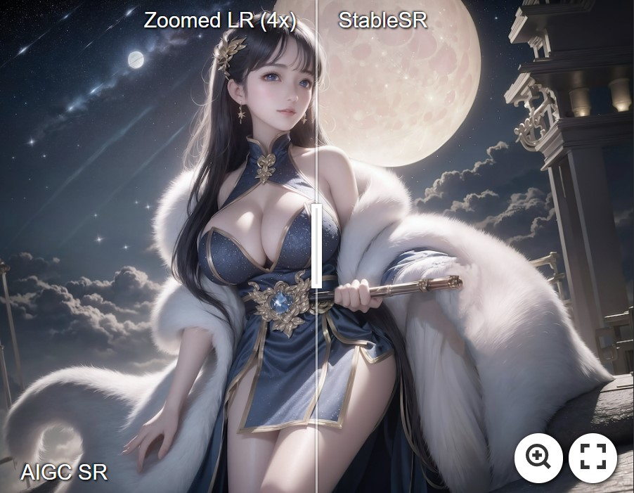

<p align="center">
  
</p>

## Exploiting Diffusion Prior for Real-World Image Super-Resolution

[Paper](https://arxiv.org/abs/2305.07015) | [Project Page](https://iceclear.github.io/projects/stablesr/) | [Video](https://www.youtube.com/watch?v=5MZy9Uhpkw4)


<a href="https://colab.research.google.com/drive/11SE2_oDvbYtcuHDbaLAxsKk_o3flsO1T?usp=sharing"></a> 


[Jianyi Wang](https://iceclear.github.io/), [Zongsheng Yue](https://zsyoaoa.github.io/), [Shangchen Zhou](https://shangchenzhou.com/), [Kelvin C.K. Chan](https://ckkelvinchan.github.io/), [Chen Change Loy](https://www.mmlab-ntu.com/person/ccloy/)

S-Lab, Nanyang Technological University


### Update
- **2023.05.22**: :whale: Improve the code to save more GPU memory, now 128 --> 512 needs 8.9G. Enable start from intermediate steps.
- **2023.05.20**: The [WebUI Demo](https://github.com/pkuliyi2015/sd-webui-stablesr) of StableSR is avaliable. Thank [Li Yi](https://github.com/pkuliyi2015) for the implementation!
- **2023.05.13**: Add Colab demo of StableSR. <a href="https://colab.research.google.com/drive/11SE2_oDvbYtcuHDbaLAxsKk_o3flsO1T?usp=sharing"></a>
- **2023.05.11**: Repo is released.

### TODO
- [ ] HuggingFace demo
- [ ] Replicate demo
- [x] ~~Code release~~
- [x] ~~Update link to paper and project page~~
- [x] ~~Pretrained models~~
- [x] ~~Colab demo~~

### Demo on real-world SR

[](https://imgsli.com/MTc2MTI2) [](https://imgsli.com/MTc2MTE2) [](https://imgsli.com/MTc2MTIw)
[](https://imgsli.com/MTc2MjUy) [](https://imgsli.com/MTc2MTMy) [](https://imgsli.com/MTc2MTMz)
[](https://imgsli.com/MTc2MjQ5) [](https://imgsli.com/MTc2MTM0) [](https://imgsli.com/MTc2MTM2) [](https://imgsli.com/MTc2MjU0)

For more evaluation, please refer to our [paper](https://arxiv.org/abs/2305.07015) for details.

### Demo on 4K Results

- StableSR is capable of achieving arbitrary upscaling in theory, below is a 8x example with a result beyond 4K (5120x3680).
The example image is taken from [here](https://github.com/Mikubill/sd-webui-controlnet/blob/main/tests/images/ski.jpg).

[](https://imgsli.com/MTc4NDk2)

- We further directly test StableSR on AIGC and compared with several diffusion-based upscalers following the suggestions.
A 4K demo is [here](https://imgsli.com/MTc4MDg3), which is a 4x SR on the image from [here](https://github.com/pkuliyi2015/multidiffusion-upscaler-for-automatic1111).
More comparisons can be found [here](https://github.com/IceClear/StableSR/issues/2).

### Dependencies and Installation
- Pytorch == 1.12.1
- CUDA == 11.7
- pytorch-lightning==1.4.2
- xformers == 0.0.16 (Optional)
- Other required packages in `environment.yaml`
```
# git clone this repository
git clone https://github.com/IceClear/StableSR.git
cd StableSR

# Create a conda environment and activate it
conda env create --file environment.yaml
conda activate stablesr

# Install xformers
conda install xformers -c xformers/label/dev

# Install taming & clip
pip install -e git+https://github.com/CompVis/taming-transformers.git@master#egg=taming-transformers
pip install -e git+https://github.com/openai/CLIP.git@main#egg=clip
pip install -e .
```

### Running Examples

#### Train
Download the pretrained Stable Diffusion models from [[HuggingFace](https://huggingface.co/stabilityai/stable-diffusion-2-1-base)]

- Train Time-aware encoder with SFT: set the ckpt_path in config files ([Line 22](https://github.com/IceClear/StableSR/blob/main/configs/stableSRNew/v2-finetune_text_T_512.yaml#L22) and [Line 55](https://github.com/IceClear/StableSR/blob/main/configs/stableSRNew/v2-finetune_text_T_512.yaml#L55))
```
python main.py --train --base configs/stableSRNew/v2-finetune_text_T_512.yaml --gpus GPU_ID, --name NAME --scale_lr False
```

- Train CFW: set the ckpt_path in config files ([Line 6](https://github.com/IceClear/StableSR/blob/main/configs/autoencoder/autoencoder_kl_64x64x4_resi.yaml#L6)).

You need to first generate training data using the finetuned diffusion model in the first stage. The data folder should be like this:
```
CFW_trainingdata/
    └── inputs
          └── 00000001.png # LR images
          └── ...
    └── gts
          └── 00000001.png # GT images
          └── ...
    └── latents
          └── 00000001.npy # Latent codes (4D tensors) of HR images generated by the diffusion U-net, saved in .npy format.
          └── ...
    └── samples
          └── 00000001.png # The HR images generated from latent codes, just to make sure the generated latents are correct.
          └── ...
```

Then you can train CFW:
```
python main.py --train --base configs/autoencoder/autoencoder_kl_64x64x4_resi.yaml --gpus GPU_ID, --name NAME --scale_lr False
```

#### Resume

```
python main.py --train --base configs/stableSRNew/v2-finetune_text_T_512.yaml --gpus GPU_ID, --resume RESUME_PATH --scale_lr False
```

#### Test

Download the Diffusion and VQGAN pretrained models from [[HuggingFace](https://huggingface.co/Iceclear/StableSR/blob/main/README.md) | [Google Drive](https://drive.google.com/drive/folders/1FBkW9FtTBssM_42kOycMPE0o9U5biYCl?usp=sharing) | [OneDrive](https://entuedu-my.sharepoint.com/:f:/g/personal/jianyi001_e_ntu_edu_sg/Et5HPkgRyyxNk269f5xYCacBpZq-bggFRCDbL9imSQ5QDQ)].
We use the same color correction scheme introduced in paper by default.
You may change ```--colorfix_type wavelet``` for better color correction.
You may also disable color correction by ```--colorfix_type nofix```

- Test on 128 --> 512: You need at least 10G GPU memory to run this script (batchsize 2 by default)
```
python scripts/sr_val_ddpm_text_T_vqganfin_old.py --config configs/stableSRNew/v2-finetune_text_T_512.yaml --ckpt CKPT_PATH --vqgan_ckpt VQGANCKPT_PATH --init-img INPUT_PATH --outdir OUT_DIR --ddpm_steps 200 --dec_w 0.5 --colorfix_type adain
```
- Test on arbitrary size w/o chop for VQGAN (for results beyond 512): The memory cost depends on your image size, but usually above 10G.
```
python scripts/sr_val_ddpm_text_T_vqganfin_oldcanvas.py --config configs/stableSRNew/v2-finetune_text_T_512.yaml --ckpt CKPT_PATH --vqgan_ckpt VQGANCKPT_PATH --init-img INPUT_PATH --outdir OUT_DIR --ddpm_steps 200 --dec_w 0.5 --colorfix_type adain
```

- Test on arbitrary size w/ chop for VQGAN: Current default setting needs at least 18G to run, you may reduce the VQGAN tile size by setting ```--vqgantile_size``` and ```--vqgantile_stride```.
Note the min tile size is 512 and stride should be smaller than tile size. Smaller size may introduce more border artifacts.
```
python scripts/sr_val_ddpm_text_T_vqganfin_oldcanvas_tile.py --config configs/stableSRNew/v2-finetune_text_T_512.yaml --ckpt CKPT_PATH --vqgan_ckpt VQGANCKPT_PATH --init-img INPUT_PATH --outdir OUT_DIR --ddpm_steps 200 --dec_w 0.5 --colorfix_type adain
```

### Citation
If our work is useful for your research, please consider citing:

    @inproceedings{wang2023exploiting,
        author = {Wang, Jianyi and Yue, Zongsheng and Zhou, Shangchen and Chan, Kelvin CK and Loy, Chen Change},
        title = {Exploiting Diffusion Prior for Real-World Image Super-Resolution},
        booktitle = {arXiv preprint arXiv:2305.07015},
        year = {2023}
    }

### License

This project is licensed under <a rel="license" href="https://github.com/IceClear/StableSR/blob/main/LICENSE.txt">NTU S-Lab License 1.0</a>. Redistribution and use should follow this license.

### Acknowledgement

This project is based on [stablediffusion](https://github.com/Stability-AI/stablediffusion), [latent-diffusion](https://github.com/CompVis/latent-diffusion), [SPADE](https://github.com/NVlabs/SPADE), [mixture-of-diffusers](https://github.com/albarji/mixture-of-diffusers) and [BasicSR](https://github.com/XPixelGroup/BasicSR). Thanks for their awesome works.

### Contact
If you have any question, please feel free to reach me out at `iceclearwjy@gmail.com`.
